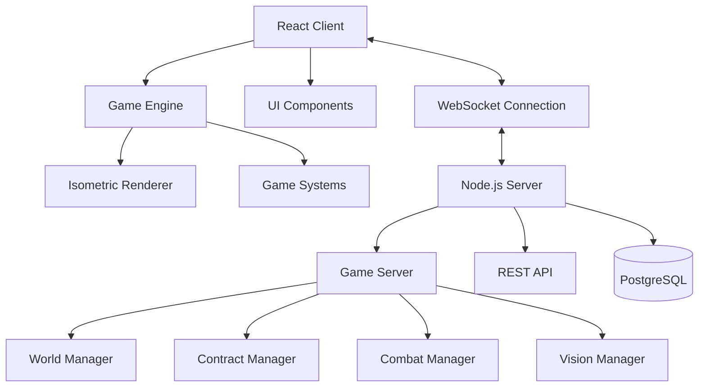

# Design Document

## Overview

Fixer is a hardcore multiplayer cyberpunk roguelike featuring an isometric view of a procedurally generated dystopian city. The game combines real-time action combat, strategic vision mechanics, neural program hacking, and permadeath consequences in a persistent online world. Players take on the role of cybernetic-enhanced mercenaries who complete AI-generated contracts, engage in PvP combat, and survive in an economically pressured urban environment.

### Core Design Principles

1. **Hardcore Consequences**: Death means losing all items and progress, creating meaningful tension
2. **Strategic Vision**: Fog of war and surveillance systems create tactical depth
3. **Neural Program Hacking**: Unique cheat-like programs (wallhack.exe, aimbot.exe) provide temporary advantages
4. **Emergent Gameplay**: Systems interact to create unpredictable player stories
5. **Cyberpunk Authenticity**: Technology, atmosphere, and themes reflect the genre

## Architecture

### System Architecture Overview



### Technology Stack

**Frontend**
- React 18 + TypeScript for UI components
- Custom Canvas-based game engine for isometric rendering
- Zustand for state management
- Socket.io-client for real-time communication
- Howler.js for audio management

**Backend**
- Node.js + Express.js for API server
- Socket.io for real-time multiplayer
- PostgreSQL with Prisma ORM for data persistence
- JWT for authentication
- Spatial partitioning for performance

## Components and Interfaces

### Client-Side Architecture

#### Game Engine Core
```typescript
interface GameEngine {
  renderer: IsometricRenderer;
  inputManager: InputManager;
  systemManager: SystemManager;
  entityManager: EntityManager;
  uiManager: CyberpunkUIManager;
  chatSystem: ChatSystem;
  
  initialize(): Promise<void>;
  update(deltaTime: number): void;
  render(): void;
  shutdown(): void;
}
```

#### Cyberpunk UI Manager
```typescript
interface CyberpunkUIManager {
  // Core UI elements
  hud: CyberpunkHUD;
  chatBox: CyberpunkChatBox;
  inventory: CyberpunkInventory;
  pauseMenu: CyberpunkPauseMenu;
  
  // Party UI (unobtrusive)
  partyUI: MinimalPartyUI;
  
  // Smart features
  smartHighlighter: SmartHighlighter;
  smartHints: SmartHintSystem;
  
  renderUI(): void;
  updateCyberpunkEffects(): void;
  handleUIInput(input: InputEvent): void;
}

interface CyberpunkHUD {
  // Minimal HUD without minimap
  healthBar: HealthDisplay;
  creditsDisplay: CreditsDisplay;
  activeProgramsDisplay: ActiveProgramsDisplay;
  
  // No minimap - rely on spatial awareness
  renderMinimalHUD(): void;
  applyCyberpunkStyling(): void;
}
```

#### Isometric Renderer
```typescript
interface IsometricRenderer {
  canvas: HTMLCanvasElement;
  context: CanvasRenderingContext2D;
  camera: Camera;
  
  // Core rendering
  render(entities: Entity[], world: WorldChunk[]): void;
  worldToScreen(worldPos: Vector2): Vector2;
  screenToWorld(screenPos: Vector2): Vector2;
  
  // Depth sorting
  sortEntitiesByDepth(entities: Entity[]): Entity[];
  
  // Vision system
  renderFogOfWar(visionData: VisionData): void;
  renderVisionOverlays(surveillance: SurveillanceData[]): void;
}
```

#### Input Management
```typescript
interface InputManager {
  // Movement controls
  isKeyPressed(key: string): boolean;
  getMovementVector(): Vector2;
  
  // Action controls
  onSpacePress: () => void; // Roll/dodge
  onEPress: () => void;     // Interact
  onCPress: () => void;     // Prone toggle
  onIPress: () => void;     // Inventory
  onEscapePress: () => void; // Pause menu
  
  // Mouse controls
  getMouseWorldPosition(): Vector2;
  onMouseClick: (button: number) => void;
}
```

### Server-Side Architecture

#### Game Server Core
```typescript
interface GameServer {
  players: Map<string, Player>;
  worldManager: WorldManager;
  contractManager: ContractManager;
  combatManager: CombatManager;
  visionManager: VisionManager;
  
  // Game loop
  startGameLoop(): void;
  update(deltaTime: number): void;
  
  // Player management
  addPlayer(player: Player): void;
  removePlayer(playerId: string): void;
  broadcastToNearbyPlayers(position: Vector2, data: any): void;
}
```

#### World Management
```typescript
interface WorldManager {
  chunks: Map<string, WorldChunk>;
  
  // Chunk management
  generateChunk(x: number, y: number): WorldChunk;
  getChunk(x: number, y: number): WorldChunk;
  unloadChunk(x: number, y: number): void;
  
  // Building generation
  generateBuildings(chunk: WorldChunk): Building[];
  generateRoadNetwork(chunks: WorldChunk[]): Road[];
}
```

#### Chat System and Neural Program Activation
```typescript
interface ChatSystem {
  chatBox: CyberpunkChatBox;
  commandProcessor: NeuralCommandProcessor;
  
  // Chat functionality
  sendMessage(message: string): void;
  receiveMessage(message: ChatMessage): void;
  
  // Neural program activation via chat
  processCommand(command: string): CommandResult;
  activateNeuralProgram(programName: string): boolean;
  
  // Chat styling
  applyCyberpunkStyling(): void;
  addGlitchEffects(): void;
}

interface NeuralCommandProcessor {
  availablePrograms: NeuralProgram[];
  
  parseCommand(input: string): ParsedCommand;
  validateProgram(programName: string): boolean;
  executeProgram(program: NeuralProgram): ExecutionResult;
  
  // Command responses in cyberpunk style
  generateSuccessMessage(program: string): string;
  generateErrorMessage(error: string): string;
}
```

#### Granular Object Hacking System
```typescript
interface ObjectHackingManager {
  // Hackable object detection
  detectHackableObjects(position: Vector2, range: number): HackableObject[];
  
  // Specific object types
  hackPhone(phoneId: string, playerId: string): PhoneHackResult;
  hackComputer(computerId: string, playerId: string): ComputerHackResult;
  hackTerminal(terminalId: string, playerId: string): TerminalHackResult;
  hackCamera(cameraId: string, playerId: string): CameraHackResult;
  
  // Hacking process
  initiateHack(objectId: string, hackType: HackType): HackSession;
  processHackingMinigame(session: HackSession, input: any): HackProgress;
  completeHack(session: HackSession): HackResult;
}

interface HackableObject {
  id: string;
  type: ObjectType;
  position: Vector2;
  securityLevel: number;
  hackable: boolean;
  
  // Object-specific data
  data: ObjectData;
  connectedSystems: string[];
}

enum ObjectType {
  PHONE = 'phone',
  COMPUTER = 'computer',
  TERMINAL = 'terminal',
  SECURITY_CAMERA = 'camera',
  DOOR_LOCK = 'door_lock',
  ELEVATOR_CONTROL = 'elevator'
}
```

#### Smart Features System
```typescript
interface SmartFeaturesManager {
  highlighter: SmartHighlighter;
  targeting: SmartTargeting;
  navigation: SmartNavigation;
  hints: SmartHintSystem;
  
  update(player: Player, context: GameContext): void;
  renderSmartOverlays(): void;
}

interface SmartHighlighter {
  // Subtle highlighting of interactive objects
  highlightInteractables(objects: GameObject[]): HighlightData[];
  highlightHackables(objects: HackableObject[]): HighlightData[];
  
  // Context-aware highlighting
  updateHighlights(playerContext: PlayerContext): void;
  renderHighlights(highlights: HighlightData[]): void;
}

interface SmartTargeting {
  // Assist with aiming without being overpowered
  calculateTargetingAssist(mousePos: Vector2, targets: Entity[]): Vector2;
  provideCrosshairFeedback(target: Entity): CrosshairState;
  
  // Respect player skill while providing subtle help
  adjustAssistLevel(playerSkill: number): number;
}
```

#### Vision System
```typescript
interface VisionManager {
  // Player vision
  calculatePlayerVision(player: Player): VisionData;
  updateFogOfWar(playerId: string, position: Vector2): void;
  
  // Surveillance
  deploySurveillance(item: SurveillanceItem, position: Vector2): void;
  updateSurveillanceFeeds(): SurveillanceData[];
  hackSurveillance(playerId: string, targetId: string): boolean;
}
```

## Data Models

### Core Entities

#### Player Entity
```typescript
interface Player {
  id: string;
  userId: string;
  username: string;
  
  // Position and movement
  position: Vector2;
  velocity: Vector2;
  facing: number;
  
  // Stats
  health: number;
  maxHealth: number;
  credits: number;
  
  // State
  isAlive: boolean;
  isProne: boolean;
  isRolling: boolean;
  
  // Equipment
  inventory: InventoryItem[];
  equippedWeapon: Weapon | null;
  augmentations: Augmentation[];
  
  // Neural programs
  neuralPrograms: NeuralProgram[];
  systemHeat: number;
  
  // Vision
  visionRange: number;
  visionData: VisionData;
  
  // Housing
  housing: Housing | null;
  
  // Contracts
  activeContracts: Contract[];
}
```

#### World Chunk
```typescript
interface WorldChunk {
  id: string;
  x: number;
  y: number;
  districtType: DistrictType;
  
  // Generated content
  buildings: Building[];
  roads: Road[];
  lootSpawns: LootSpawn[];
  
  // Metadata
  generated: boolean;
  lastAccessed: number;
  securityLevel: number;
}

enum DistrictType {
  CORPORATE = 'corporate',
  INDUSTRIAL = 'industrial', 
  RESIDENTIAL = 'residential',
  UNDERGROUND = 'underground',
  WASTELAND = 'wasteland'
}
```

#### Neural Programs
```typescript
interface NeuralProgram {
  id: string;
  name: string;
  filename: string; // e.g., "wallhack.exe", "aimbot.exe"
  type: ProgramType;
  
  // Effects
  effects: ProgramEffect[];
  duration: number;
  heatGeneration: number;
  
  // Requirements
  requiredAugmentations: string[];
  creditsCost: number;
}

enum ProgramType {
  WALLHACK = 'wallhack',
  AIMBOT = 'aimbot', 
  BULLETTIME = 'bullettime',
  THERMAL_VISION = 'thermal',
  SPEED_BOOST = 'speed',
  STEALTH = 'stealth'
}
```

#### Vision System
```typescript
interface VisionData {
  playerId: string;
  visibleArea: Circle;
  fogOfWar: FogTile[];
  visibleEntities: string[];
  
  // Line of sight
  losObstacles: Rectangle[];
  visionShadows: Polygon[];
}

interface SurveillanceData {
  id: string;
  type: SurveillanceType;
  position: Vector2;
  visionCone: Cone;
  ownerId: string;
  isActive: boolean;
  hackable: boolean;
}

enum SurveillanceType {
  SECURITY_CAMERA = 'camera',
  DRONE = 'drone',
  MOTION_SENSOR = 'sensor'
}
```

### Contract System
```typescript
interface Contract {
  id: string;
  fixerId: string;
  type: ContractType;
  
  // Objectives
  title: string;
  description: string;
  objectives: ContractObjective[];
  
  // Rewards and constraints
  reward: ContractReward;
  timeLimit: number;
  difficultyLevel: number;
  
  // Target information
  target: ContractTarget;
  location: Vector2;
  
  // Status
  status: ContractStatus;
  acceptedBy: string | null;
  completedAt: number | null;
}

enum ContractType {
  ASSASSINATION = 'assassination',
  DATA_EXTRACTION = 'data_extraction',
  SABOTAGE = 'sabotage',
  ESCORT = 'escort',
  RECOVERY = 'recovery',
  SURVEILLANCE = 'surveillance'
}
```

## Error Handling

### Client-Side Error Handling

#### Network Errors
```typescript
class NetworkErrorHandler {
  handleConnectionLoss(): void {
    // Show reconnection UI
    // Attempt automatic reconnection
    // Preserve game state during disconnection
  }
  
  handleLatencySpikes(): void {
    // Enable client-side prediction
    // Show network status indicators
    // Graceful degradation of features
  }
}
```

#### Rendering Errors
```typescript
class RenderingErrorHandler {
  handleCanvasErrors(): void {
    // Fallback to lower quality rendering
    // Report performance issues
    // Maintain playability
  }
  
  handleAssetLoadingErrors(): void {
    // Use placeholder assets
    // Retry loading in background
    // Continue gameplay
  }
}
```

### Server-Side Error Handling

#### Database Errors
```typescript
class DatabaseErrorHandler {
  handleConnectionErrors(): void {
    // Implement connection pooling
    // Retry failed queries
    // Maintain data consistency
  }
  
  handleDataCorruption(): void {
    // Validate data integrity
    // Restore from backups
    // Notify affected players
  }
}
```

#### Game State Errors
```typescript
class GameStateErrorHandler {
  handlePlayerDesync(): void {
    // Resynchronize player state
    // Validate positions and actions
    // Prevent exploitation
  }
  
  handleWorldGenerationErrors(): void {
    // Regenerate corrupted chunks
    // Maintain world consistency
    // Log generation failures
  }
}
```

## Testing Strategy

### Unit Testing
- **Component Testing**: Individual game systems (combat, vision, contracts)
- **Utility Testing**: Math functions, coordinate conversions, pathfinding
- **Data Model Testing**: Serialization, validation, state management

### Integration Testing
- **Client-Server Communication**: WebSocket message handling
- **Database Integration**: CRUD operations, data consistency
- **System Interactions**: How vision affects combat, neural programs interact

### Performance Testing
- **Load Testing**: Multiple players in same area
- **Stress Testing**: Maximum concurrent players
- **Memory Testing**: Chunk loading/unloading, object pooling

### Gameplay Testing
- **Balance Testing**: Weapon damage, neural program effects
- **Progression Testing**: Contract difficulty scaling
- **Social Testing**: Player interaction, griefing prevention

### Automated Testing Pipeline
```typescript
// Example test structure
describe('Vision System', () => {
  test('should calculate line of sight correctly', () => {
    const player = createTestPlayer();
    const obstacles = createTestObstacles();
    const vision = calculateVision(player, obstacles);
    
    expect(vision.visibleArea).toBeDefined();
    expect(vision.visionShadows.length).toBeGreaterThan(0);
  });
  
  test('should handle fog of war updates', () => {
    const visionManager = new VisionManager();
    const player = createTestPlayer();
    
    visionManager.updateFogOfWar(player.id, player.position);
    
    expect(visionManager.getFogData(player.id)).toBeDefined();
  });
});
```

## Implementation Considerations

### Performance Optimization

#### Client-Side Optimizations
- **Viewport Culling**: Only render visible entities and tiles
- **Object Pooling**: Reuse bullets, effects, and temporary objects
- **Animation Optimization**: Use sprite sheets and efficient frame management
- **Memory Management**: Proper cleanup of unused resources

#### Server-Side Optimizations
- **Spatial Partitioning**: Divide world into regions for efficient queries
- **Update Frequency**: Different update rates for different systems
- **Database Optimization**: Proper indexing and query optimization
- **Caching**: Redis for frequently accessed data

### Security Considerations

#### Anti-Cheat Measures
- **Server Authority**: All critical game state managed server-side
- **Input Validation**: Validate all client inputs for plausibility
- **Rate Limiting**: Prevent spam and rapid-fire exploits
- **Position Validation**: Ensure players can't teleport or move impossibly fast

#### Data Protection
- **Encryption**: Secure communication between client and server
- **Authentication**: JWT tokens with proper expiration
- **Input Sanitization**: Prevent injection attacks
- **Privacy**: Protect player data and communications

### Scalability Planning

#### Horizontal Scaling
- **Load Balancing**: Distribute players across multiple server instances
- **Database Sharding**: Partition data by geographic regions
- **CDN Integration**: Serve static assets efficiently
- **Microservices**: Separate concerns into independent services

#### Monitoring and Analytics
- **Performance Metrics**: Track FPS, latency, memory usage
- **Player Analytics**: Monitor engagement, retention, progression
- **Error Tracking**: Comprehensive logging and error reporting
- **Business Metrics**: Revenue, conversion rates, player lifetime value

This design document provides the comprehensive technical foundation needed to implement Fixer according to the approved requirements. Each system is designed to work together while remaining modular for easier development, testing, and maintenance.